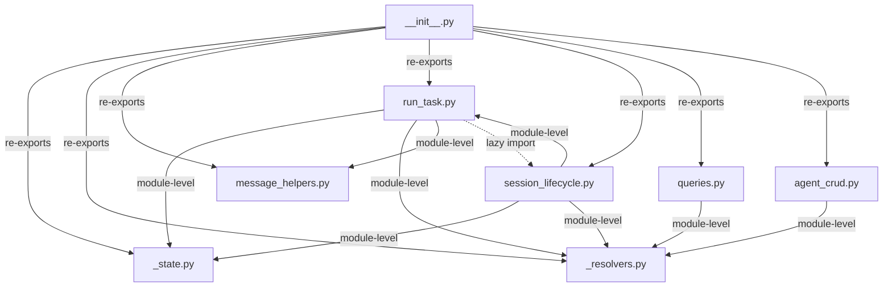

# Decompose service.py into service/ Package

## Overview

Convert `ypl/agent_harness_service/service.py` (3,489 lines, 58 functions) into a `service/` package with focused submodules. Then break `_run_agent_task` (821 lines) into phase functions with an explicit state-passing contract. This is a pure structural refactor — no behavioral changes.

## Problem Frame

`service.py` is the most-imported wiring-layer module (9 callers). Its largest function `_run_agent_task` is 821 lines with 73 if-statements. When an AI agent needs to modify session lifecycle behavior, it must load the entire file into context and reason about a function that exceeds most models' effective reasoning window. (see origin: `docs/brainstorms/2026-03-30-service-py-decomposition-requirements.md`)

## Requirements Trace

- R1. Phase-based decomposition of `_run_agent_task` into sequential phase functions with ~50-line orchestrator
- R2. Split `service.py` into a `service/` package with focused submodules
- R3. Backward-compatible re-exports — 9 existing callers work with zero import changes
- R4. Preserve AHS layering rules — architecture tests pass
- R5. No behavioral changes — all existing tests pass without logic changes

## Scope Boundaries

- Out of scope: Refactoring `local_mcp_server.py` or `orchestration.py`
- Out of scope: Changing any public API behavior or signatures
- Out of scope: Adding new abstractions (classes, protocols) beyond what the split requires
- Out of scope: Migrating callers to direct submodule imports (can happen later)

## Context & Research

### Relevant Code and Patterns

- **Package pattern to follow:** `ypl/agent_harness_service/gateway/` — uses `__all__` with explicit re-exports in `__init__.py`. This is the right model since 9 callers import specific symbols.
- **Architecture test mechanics:** `test_architecture.py` uses `ROOT_WIRING = {"service", "server", "routes", ...}` as stem names. `_module_to_package("ypl.agent_harness_service.service.run_task")` returns `"service"` — still matches. However, `_collect_python_files` walks from `AHS_ROOT` and will treat `service/` submodules as Layer 1 packages. **Must add `"service"` to `EXCLUDED_DIRS`.**
- **`test_imports.py`:** Hardcodes `"ypl.agent_harness_service.service"` in `ROOT_MODULES`. Will still resolve to the package `__init__`. Should add new submodules to the list.
- **Lazy import pattern:** Used extensively (e.g., `tools/local_mcp_server.py` lazily imports `create_agent`). Architecture tests only check module-level imports.
- **DI callback pattern:** Required for Layer 1 → wiring-layer calls (see `register_orchestration_callbacks()`). Not needed here since all new submodules stay in the wiring layer.

### Institutional Learnings

- ARCHITECTURE.md explicitly calls out `service.py` as "godfile risk" and suggests decomposition into session creation, turn handling, and state management.
- `mcp_server/tools/project_tasks.py` and `slack_agent_gateway/bot_father.py` import AHS internals directly — any refactoring must preserve their import paths.
- `session.connection()` after `session.close()` silently leaks connections — don't split DB session management across module boundaries.

## Key Technical Decisions

- **Two-PR strategy over single PR:** The file-level split (service.py → service/) and the `_run_agent_task` phase decomposition are combined in one plan but should land as two separate PRs. The file split is already high-risk (touches all callers, architecture tests). Combining it with an 821-line function rewrite doubles blast radius. PR1 moves `_run_agent_task` wholesale into `run_task.py`; PR2 breaks it into phases. (see origin: Key Decisions — "Phase-based over class-based")

- **Dedicated `_state.py` for shared mutable state:** The 4 module-level mutable dicts (`_active_tasks`, `_pre_spawn_tasks`, `_command_handlers`, `_pending_messages`) are accessed by functions across multiple proposed submodules. Scattering them creates aliasing risk. A single `_state.py` module owns them all — every submodule imports from `_state`. `__init__.py` does NOT re-export these private names (except `_command_handlers` for test compat).

- **Lazy imports to break circular dependency:** `session_lifecycle.py` imports `run_task.py` at module level (for `_run_agent_task`). `run_task.py` uses lazy imports for `_drain_pending_messages` and `send_message` from `session_lifecycle.py` (only called in the finally block). This follows the existing lazy-import pattern approved by architecture tests.

- **`TurnContext` dataclass for phase state passing:** Instead of inner functions sharing closure variables (which doesn't reduce cognitive load), phases accept and return a typed `TurnContext` dataclass. This makes data flow between phases explicit and enables unit testing of individual phases.

- **Re-export private names consumed by tests:** `_command_handlers` (used by `test_service_bch_lifecycle.py`) and `_extract_tool_uses` (used by `test_service.py`) are re-exported from `__init__.py` with a `# test-only export` comment.

## Open Questions

### Resolved During Planning

- **Q: Do architecture tests hardcode `service.py` or detect dynamically?** Resolution: `ROOT_WIRING` uses stem names (`"service"`), which will match the package. But `_collect_python_files` treats `service/` as a Layer 1 directory — must add `"service"` to `EXCLUDED_DIRS`.
- **Q: Are there circular import risks?** Resolution: Yes. `send_message` → `_run_agent_task` → `_drain_pending_messages` → `send_message`. Broken by lazy imports in `run_task.py` for the drain/inject path.
- **Q: Where do the 12 unassigned functions go?** Resolution: See complete function assignment below. DB resolution helpers go to `_resolvers.py`. `deliver_subagent_result_to_parent` and `_inject_internal_message` go to `session_lifecycle.py`.

### Deferred to Implementation

- Exact field set for `TurnContext` dataclass — requires reading every local variable in `_run_agent_task` and tracing which phases use which
- Whether any phase function exceeds 200 lines after extraction — may need further splitting during implementation
- Whether mypy requires explicit type annotations on re-exports in `__init__.py`

## High-Level Technical Design

> *This illustrates the intended approach and is directional guidance for review, not implementation specification. The implementing agent should treat it as context, not code to reproduce.*

### Package Structure

```
service/
├── __init__.py          # Re-exports all public names via __all__ (~60 lines)
├── _state.py            # 4 mutable dicts + constants + capacity helpers (~60 lines)
├── _resolvers.py        # DB lookup helpers: _resolve_agent, _resolve_session, etc. (~220 lines)
├── message_helpers.py   # Data sanitization, content extraction, tool extractors (~250 lines)
├── run_task.py          # _run_agent_task orchestrator + phase functions (~1000 lines → ~900 after phase split)
├── session_lifecycle.py # create_session, send_message, stop_session, attach, inject, drain, deliver (~900 lines)
├── queries.py           # list_sessions, get_session_detail, list_agents, get_session_history, send_feedback (~400 lines)
└── agent_crud.py        # create_agent, edit_agent, _build_agent_info (~150 lines)
```

### Complete Function Assignment

| Function | Target Module | Notes |
|----------|--------------|-------|
| `_active_tasks`, `_pre_spawn_tasks`, `_command_handlers`, `_pending_messages` | `_state.py` | Mutable dicts |
| `PendingMessage`, `MAX_CONCURRENT_EXECUTIONS`, all static constants | `_state.py` | |
| `get_active_turn_count`, `has_execution_capacity` | `_state.py` | Read from `_active_tasks` |
| `_trim_value`, `_trim_field`, `_scrub_null_bytes` | `message_helpers.py` | Data sanitization |
| `VisibleContent`, `_extract_visible_content`, `_extract_outlet_tool_content` | `message_helpers.py` | Stream parsing |
| `strip_thinking_tags`, `_THINKING_TAG_PATTERN` | `message_helpers.py` | |
| `_truncate_tool_output`, `_message_content_blocks`, `_iter_tool_use_blocks`, `_iter_tool_result_blocks`, `_extract_tool_use_id`, `_extract_tool_name`, `_extract_tool_input`, `_extract_tool_output`, `_extract_tool_uses` | `message_helpers.py` | Tool extraction |
| `_resolve_user_name_from_db`, `_resolve_personal_agent_for_user`, `_resolve_agent`, `_load_agent_config_with_db_fallback`, `_resolve_session`, `_next_turn_number`, `_has_inflight_turn`, `_download_attachments_to_workspace`, `_prepend_attachment_paths`, `_mark_session_completed`, `PERSONAL_AGENT_PREFIXES` | `_resolvers.py` | DB helpers used by both session_lifecycle and run_task |
| `EagerPersistState`, `_persist_system_msg`, `_eager_persist_agent_msg` | `run_task.py` | Tightly coupled to turn execution |
| `_run_agent_task` | `run_task.py` | Core turn runner |
| `create_session`, `send_message`, `stop_session`, `attach_slack_to_session` | `session_lifecycle.py` | |
| `_drain_pending_messages`, `_inject_internal_message`, `deliver_subagent_result_to_parent`, `_maybe_update_task_completion` | `session_lifecycle.py` | Message dispatch / subagent delivery |
| `send_slack_shutdown_courtesy`, `send_slack_restart_courtesy`, `stop_all_command_handler_managers` | `session_lifecycle.py` | Server lifecycle (too small for own module) |
| `get_session_history`, `_build_session_info`, `list_sessions`, `get_session_detail` | `queries.py` | |
| `list_agents`, `get_agent_detail`, `send_feedback` | `queries.py` | |
| `create_agent`, `edit_agent`, `_build_agent_info`, `_build_agent_info_from_db` | `agent_crud.py` | |

### Import Graph Between Submodules



Solid arrows = module-level imports. Dashed arrows = lazy imports (inside function bodies).

### Phase Decomposition of `_run_agent_task` (PR2)

```
_run_agent_task(session, message, ...)   # ~50-line orchestrator
    ├── _setup_turn(ctx)                  # ~80 lines: guard, config, runner selection, gateway resolution
    ├── _init_turn_state(ctx)             # ~50 lines: event accumulator, metrics, eager persist, websocket publish
    ├── _stream_events(ctx)               # ~200 lines: event loop, tool tracking, gateway delivery, content extraction
    ├── _handle_turn_result(ctx)          # ~200 lines: success path — persist, mark complete, auto-feedback
    ├── _handle_turn_error(ctx, exc)      # ~130 lines: error/cancel path — persist error, notify
    └── _cleanup_turn(ctx)                # ~70 lines: finally block — clear state, drain pending, GCS sync
```

Each phase receives and mutates a `TurnContext` dataclass. The orchestrator wraps phases in try/except/finally.

## Implementation Units

### PR1: File-Level Split (service.py → service/ package)

- [ ] **Unit 1: Create `service/_state.py` and `service/message_helpers.py`**

  **Goal:** Extract zero-dependency foundations that other submodules will import.

  **Requirements:** R2

  **Dependencies:** None — these are leaf modules with no intra-service imports.

  **Files:**
  - Create: `ypl/agent_harness_service/service/__init__.py`
  - Create: `ypl/agent_harness_service/service/_state.py`
  - Create: `ypl/agent_harness_service/service/message_helpers.py`
  - Delete: (not yet — `service.py` still exists at this point)

  **Approach:**
  - Move the 4 mutable dicts, `PendingMessage`, `MAX_CONCURRENT_EXECUTIONS`, all static constants, `get_active_turn_count`, `has_execution_capacity` into `_state.py`
  - Move all data sanitization, content extraction, tool extraction functions, `VisibleContent`, `strip_thinking_tags` into `message_helpers.py`
  - Create a minimal `__init__.py` that imports from these two modules (will grow in later units)
  - Preserve all existing external imports (e.g., from `common/`, `core/`, DB models)

  **Patterns to follow:**
  - `gateway/__init__.py` for `__all__` re-export style

  **Test scenarios:**
  - Happy path: `from ypl.agent_harness_service.service._state import _active_tasks` returns the same dict object regardless of import path
  - Happy path: All functions in `message_helpers.py` produce identical output to their current behavior (verified by existing tests)
  - Edge case: `_state.py` dicts are singleton objects — importing from two different submodules yields `is`-identical references
  - Integration: `__init__.py` re-exports `has_execution_capacity`, `get_active_turn_count` — existing callers in `scheduler.py` and `task_executor.py` work unchanged

  **Verification:**
  - `poetry run pytest tests/agent_harness_service/test_service.py -v` passes (tests `_extract_tool_uses`)
  - `poetry run mypy --config-file=pyproject.toml ypl/agent_harness_service/service/` clean

---

- [ ] **Unit 2: Create `service/_resolvers.py`**

  **Goal:** Extract DB resolution helpers used by both session lifecycle and run task.

  **Requirements:** R2

  **Dependencies:** Unit 1 (`_state.py` exists for `PERSONAL_AGENT_PREFIXES`)

  **Files:**
  - Create: `ypl/agent_harness_service/service/_resolvers.py`
  - Modify: `ypl/agent_harness_service/service/__init__.py` (add re-exports)

  **Approach:**
  - Move `_resolve_user_name_from_db`, `_resolve_personal_agent_for_user`, `_resolve_agent`, `_load_agent_config_with_db_fallback`, `_resolve_session`, `_next_turn_number`, `_has_inflight_turn`, `_download_attachments_to_workspace`, `_prepend_attachment_paths`, `_mark_session_completed`, `PERSONAL_AGENT_PREFIXES` into `_resolvers.py`
  - These functions depend on DB models and `common/` — no intra-service circular risk

  **Patterns to follow:**
  - Existing DB access patterns using `async with get_async_session()` context manager

  **Test scenarios:**
  - Happy path: Each resolver function is importable from `_resolvers.py` and from `service` (via `__init__`)
  - Integration: Functions that take `AsyncSession` parameters continue to work with the existing session management pattern

  **Verification:**
  - `poetry run mypy --config-file=pyproject.toml ypl/agent_harness_service/service/_resolvers.py` clean
  - No import errors when the package is loaded

---

- [ ] **Unit 3: Create `service/queries.py` and `service/agent_crud.py`**

  **Goal:** Extract read-only query endpoints and agent CRUD — the simplest, most self-contained groups.

  **Requirements:** R2, R3

  **Dependencies:** Unit 2 (`_resolvers.py` for `_build_agent_info` helpers)

  **Files:**
  - Create: `ypl/agent_harness_service/service/queries.py`
  - Create: `ypl/agent_harness_service/service/agent_crud.py`
  - Modify: `ypl/agent_harness_service/service/__init__.py` (add re-exports)

  **Approach:**
  - Move `list_sessions`, `get_session_detail`, `get_session_history`, `list_agents`, `get_agent_detail`, `send_feedback`, `_build_session_info` into `queries.py`
  - Move `create_agent`, `edit_agent`, `_build_agent_info`, `_build_agent_info_from_db` into `agent_crud.py`
  - These have no dependency on the mutable state dicts — clean separation

  **Patterns to follow:**
  - Existing async function signatures with `AsyncSession` parameters

  **Test scenarios:**
  - Happy path: `from ypl.agent_harness_service.service import list_sessions, create_agent` works unchanged
  - Integration: `routes.py` imports (`create_agent`, `edit_agent`, `list_agents`, `get_agent_detail`, etc.) resolve correctly without changes to `routes.py`
  - Integration: Lazy imports in `tools/local_mcp_server.py` (`from ypl.agent_harness_service.service import create_agent`) still resolve

  **Verification:**
  - `poetry run pytest tests/agent_harness_service/ -v` — all existing tests pass
  - `routes.py` starts without ImportError

---

- [ ] **Unit 4: Create `service/session_lifecycle.py` and `service/run_task.py`**

  **Goal:** Extract the two largest, most coupled function groups — session lifecycle and the turn runner. This is the riskiest unit.

  **Requirements:** R2, R3

  **Dependencies:** Units 1-3 (all leaf modules exist)

  **Files:**
  - Create: `ypl/agent_harness_service/service/session_lifecycle.py`
  - Create: `ypl/agent_harness_service/service/run_task.py`
  - Modify: `ypl/agent_harness_service/service/__init__.py` (add remaining re-exports)

  **Approach:**
  - Move `_run_agent_task`, `EagerPersistState`, `_persist_system_msg`, `_eager_persist_agent_msg` into `run_task.py`
  - Move `create_session`, `send_message`, `stop_session`, `attach_slack_to_session`, `_drain_pending_messages`, `_inject_internal_message`, `deliver_subagent_result_to_parent`, `_maybe_update_task_completion`, `send_slack_shutdown_courtesy`, `send_slack_restart_courtesy`, `stop_all_command_handler_managers` into `session_lifecycle.py`
  - **Circular import resolution:** `session_lifecycle.py` imports `_run_agent_task` from `run_task` at module level. `run_task.py` uses lazy imports for `_drain_pending_messages` and `send_message` from `session_lifecycle` (only in the finally block of `_run_agent_task`)
  - Both modules import shared state from `_state.py` and helpers from `_resolvers.py`, `message_helpers.py`

  **Patterns to follow:**
  - Existing lazy import pattern (function-level `from ... import ...`) used throughout AHS
  - `create_background_task()` from `ypl.backend.utils.async_utils` for background task dispatch

  **Test scenarios:**
  - Happy path: `create_session` → `send_message` → `_run_agent_task` → `_drain_pending_messages` → `send_message` chain works (the mutual recursion path)
  - Happy path: `deliver_subagent_result_to_parent` correctly accesses `_active_tasks` and `_pending_messages` from `_state.py`
  - Edge case: Lazy imports in `run_task.py` resolve correctly at call time (not import time)
  - Edge case: `stop_session` can cancel a task in `_active_tasks` that was spawned by `send_message`
  - Error path: If `session_lifecycle` import fails, error message is clear about which module
  - Integration: `server.py` imports `send_slack_shutdown_courtesy`, `send_slack_restart_courtesy` via `service.__init__` without change
  - Integration: `test_service_bch_lifecycle.py` imports `_command_handlers` via `service.__init__`

  **Verification:**
  - `poetry run pytest tests/agent_harness_service/ -v` — all tests pass
  - `python -c "from ypl.agent_harness_service.service import create_session, send_message, _run_agent_task"` — no circular import error
  - `poetry run mypy --config-file=pyproject.toml ypl/agent_harness_service/service/` clean

---

- [ ] **Unit 5: Delete `service.py`, finalize `__init__.py`, update architecture tests**

  **Goal:** Remove the old monolith file and ensure all tests and CI pass.

  **Requirements:** R3, R4, R5

  **Dependencies:** Unit 4 (all submodules exist and are functional)

  **Files:**
  - Delete: `ypl/agent_harness_service/service.py`
  - Modify: `ypl/agent_harness_service/service/__init__.py` (finalize `__all__`, add test-only re-exports)
  - Modify: `tests/agent_harness_service/test_architecture.py` (add `"service"` to `EXCLUDED_DIRS`)
  - Modify: `tests/agent_harness_service/test_imports.py` (add new submodules to `ROOT_MODULES`)

  **Approach:**
  - Verify `__init__.py` re-exports every name that the 9 callers import (cross-reference the complete caller list from research)
  - Add `_command_handlers` and `_extract_tool_uses` to `__init__.py` re-exports with `# test-only export` comment
  - Add `"service"` to `EXCLUDED_DIRS` in `test_architecture.py` so `_collect_python_files` does not treat service submodules as Layer 1 packages
  - Add `"ypl.agent_harness_service.service.run_task"`, `"ypl.agent_harness_service.service.session_lifecycle"`, etc. to `ROOT_MODULES` in `test_imports.py`
  - Delete `service.py`

  **Patterns to follow:**
  - `gateway/__init__.py` `__all__` style

  **Test scenarios:**
  - Happy path: All 9 callers import successfully without changes to their code
  - Happy path: `test_architecture.py` passes — service submodules are recognized as wiring layer, not Layer 1
  - Happy path: `test_imports.py` passes with new submodules in `ROOT_MODULES`
  - Edge case: `TestExecutorIsolation.test_executors_do_not_import_service` still detects `"service"` in dotted path of new submodules
  - Integration: Full CI pipeline (ruff, mypy, pytest) green
  - Integration: Lazy imports in `bot_father.py`, `local_mcp_server.py`, `scheduled_agent_call_helpers.py` resolve through `__init__.py`

  **Verification:**
  - `poetry run pytest tests/agent_harness_service/test_architecture.py tests/agent_harness_service/test_imports.py -v` — all pass
  - `poetry run pytest -m 'not alembic' --timeout=120` — full test suite green
  - `poetry run ruff check ypl/agent_harness_service/service/` — clean
  - `poetry run mypy --config-file=pyproject.toml ypl/agent_harness_service/service/` — clean
  - No file in `service/` exceeds 1,000 lines

---

### PR2: Phase Decomposition of `_run_agent_task`

- [ ] **Unit 6: Define `TurnContext` dataclass and extract phase functions**

  **Goal:** Break the 821-line `_run_agent_task` into a ~50-line orchestrator calling 5-6 phase functions, each under 200 lines.

  **Requirements:** R1

  **Dependencies:** PR1 landed (Unit 5 complete)

  **Files:**
  - Modify: `ypl/agent_harness_service/service/run_task.py`
  - Create: `tests/agent_harness_service/test_run_task_phases.py`

  **Approach:**
  - Define `TurnContext` dataclass with fields discovered during implementation (runner, gateway, config, metrics, eager persist state, etc.)
  - Extract phases in order: `_setup_turn`, `_init_turn_state`, `_stream_events`, `_handle_turn_result`, `_handle_turn_error`, `_cleanup_turn`
  - The orchestrator creates `TurnContext`, calls phases in try/except/finally structure
  - Each phase mutates `ctx` in place — no return values needed for most phases
  - Phase boundaries at points where data flow is narrowest (between config loading and event streaming, between streaming and persistence)

  **Execution note:** Add characterization tests for `_run_agent_task` behavior before splitting, to catch regressions from the refactor.

  **Test scenarios:**
  - Happy path: A successful turn flows through setup → init → stream → result → cleanup with correct DB persistence
  - Happy path: Each phase function is independently callable with a properly constructed `TurnContext`
  - Edge case: `_setup_turn` detects an already-interrupted session and short-circuits
  - Edge case: `_stream_events` handles an empty event stream (runner produces no events)
  - Error path: Exception during `_stream_events` triggers `_handle_turn_error` then `_cleanup_turn`
  - Error path: `CancelledError` during streaming triggers cancel-specific error handling
  - Error path: Exception in `_cleanup_turn` itself does not mask the original error
  - Integration: The mutual recursion path (`_cleanup_turn` → `_drain_pending_messages` → `send_message` → `_run_agent_task`) still works across the phase boundary

  **Verification:**
  - `_run_agent_task` orchestrator is under 80 lines
  - No phase function exceeds 200 lines
  - `poetry run pytest tests/agent_harness_service/ -v` — all tests pass
  - `poetry run mypy --config-file=pyproject.toml ypl/agent_harness_service/service/run_task.py` — clean

## System-Wide Impact

- **Interaction graph:** `routes.py`, `server.py`, `scheduler.py`, `task_executor.py` all import from `service`. The `__init__.py` re-export layer absorbs the impact. `tools/local_mcp_server.py` and `slack_agent_gateway/bot_father.py` use lazy imports that resolve through `__init__.py`.
- **Error propagation:** No changes — all error handling stays within the same functions, just in different files.
- **State lifecycle risks:** The 4 mutable dicts must be singleton objects. Importing from `_state.py` ensures this. A regression would mean tasks are tracked in one dict instance but looked up in another — causing orphaned processes. The `_state.py` singleton test scenario guards against this.
- **API surface parity:** No API changes. All function signatures remain identical.
- **Integration coverage:** The mutual recursion path (`send_message` ↔ `_run_agent_task` ↔ `_drain_pending_messages`) is the primary cross-module integration risk. Existing tests exercise this path.
- **Unchanged invariants:** All 58 functions keep their exact signatures. All 9 callers continue importing from `ypl.agent_harness_service.service`. The AHS 3-layer architecture is preserved.

## Risks & Dependencies

| Risk | Mitigation |
|------|------------|
| Circular import between `session_lifecycle.py` and `run_task.py` | Lazy imports in `run_task.py` for drain/inject path; verify with `python -c "from ypl.agent_harness_service.service import create_session"` |
| Architecture tests treat `service/` submodules as Layer 1 | Add `"service"` to `EXCLUDED_DIRS` in `test_architecture.py` |
| Mutable dict aliasing — submodules reference different objects | `_state.py` singleton pattern + explicit test for `is`-identity |
| Missing re-export in `__init__.py` breaks a caller | Cross-reference all 9 callers' imports against `__all__` before deleting `service.py` |
| `TurnContext` field set is wrong or incomplete | Defer exact fields to implementation; trace all locals in `_run_agent_task` |
| Phase boundaries cut through tightly coupled logic | If a phase exceeds 200 lines, further split during implementation |

## Sources & References

- **Origin document:** [docs/brainstorms/2026-03-30-service-py-decomposition-requirements.md](docs/brainstorms/2026-03-30-service-py-decomposition-requirements.md)
- Related code: `ypl/agent_harness_service/service.py` (the target), `ypl/agent_harness_service/gateway/__init__.py` (package pattern)
- Architecture docs: `ypl/agent_harness_service/ARCHITECTURE.md`
- Architecture tests: `tests/agent_harness_service/test_architecture.py`, `tests/agent_harness_service/test_imports.py`
- Callers: `routes.py`, `server.py`, `scheduler.py`, `task_executor.py`, `tools/local_mcp_server.py`, `slack_agent_gateway/bot_father.py`, `mcp_common/scheduled_agent_call_helpers.py`, `tests/test_service.py`, `tests/test_service_bch_lifecycle.py`
